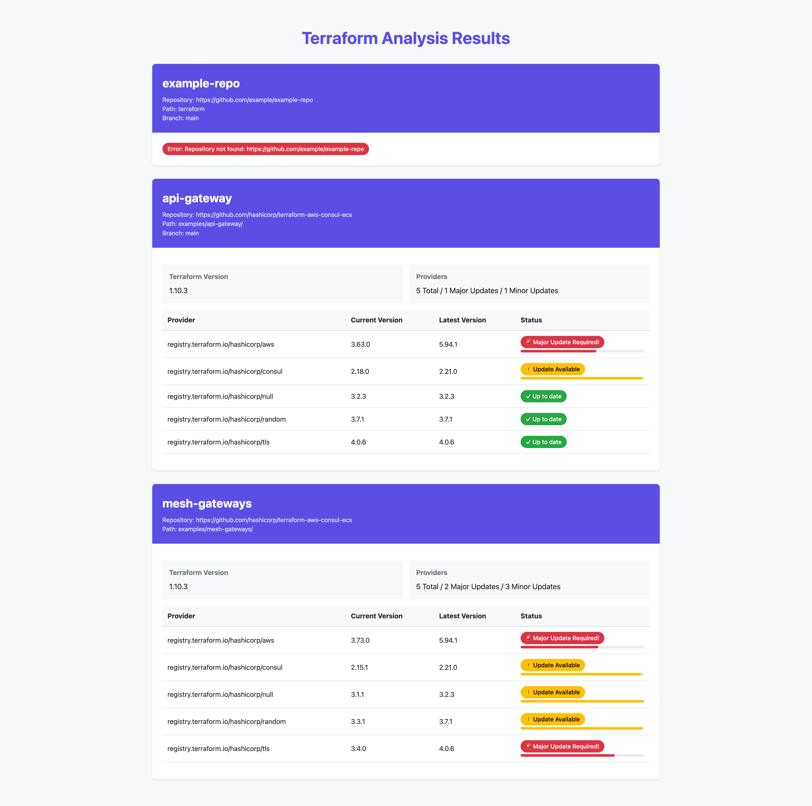

# Terraform Version Analyzer

This Python application allows you to analyze Terraform and provider versions used in different Git repositories. It can track version changes over time and output results in multiple formats.

## Prerequisites

- Python 3.8 or higher
- Git installed on your system
- `just` installed on your system
- Terraform installed on your system

## Installation

### Pre-built Binaries

Download the pre-built binary for your platform from the [latest release](https://github.com/your-org/terraform-providers-versions/releases/latest):

- Linux (x86_64): `terraform-analyzer-linux-amd64.tar.gz`
- Linux (ARM64): `terraform-analyzer-linux-arm64.tar.gz`
- macOS (x86_64): `terraform-analyzer-darwin-amd64.tar.gz`
- macOS (ARM64): `terraform-analyzer-darwin-arm64.tar.gz`

Extract and install the binary:
```bash
tar xzf terraform-analyzer-*.tar.gz
sudo mv terraform-analyzer /usr/local/bin/
```

### Docker Image

Pre-built Docker images are available for both AMD64 and ARM64 architectures:

```bash
# Pull the latest release
docker pull opsclub/terraform-providers-versions:latest

# Or a specific version
docker pull opsclub/terraform-providers-versions:v1.0.0
```

When using Docker, mount your configuration and output directories:
```bash
docker run -v $(pwd)/config.yaml:/app/config.yaml \
           -v $(pwd)/output:/app/output \
           opsclub/terraform-providers-versions:latest
```

You can specify a different Terraform version using the TERRAFORM_VERSION build argument:
```bash
docker pull opsclub/terraform-providers-versions:latest-terraform-1.7.0
```

1. Clone this repository
2. Install dependencies with just:
```bash
just setup
```

## Configuration

Create a `config.yaml` file with the following structure:

```yaml
repos:
- name: repo-name
  repository: https://github.com/user/repo
  terraform-path: path/to/terraform
  branch: main  # Optional, defaults to repository's default branch
```

Configuration options:
- `name`: Repository name (used for temporary cloning)
- `repository`: Git repository URL (supports HTTPS and SSH)
- `terraform-path`: Relative path to the directory containing Terraform files
- `branch`: Specific branch to analyze (optional)

## Usage

### Command Line

Basic usage:
```bash
just run              # Run with text output (default)
just run-json         # Run with JSON output
just run-csv          # Run with CSV output
just run-html         # Run with HTML output
just run-md           # Run with Markdown output
```

Save output to a file:
```bash
just save-output <format> <filename>  # e.g., just save-output json results.json
just save-html <filename>             # Save HTML output to a file
just save-md <filename>               # Save Markdown output to a file
```

History and version tracking:
```bash
just show-history     # Show version history for all repositories
just show-changes     # Show version changes between runs
```

Development commands:
```bash
just activate         # Activate virtual environment
just test            # Run tests
just test-cov        # Run tests with coverage
just clean           # Clean virtual environment and history
```

### Docker Support

Build and run with Docker:
```bash
just docker-build            # Build Docker image
just docker-run             # Run with text output
just docker-run-json        # Run with JSON output
just docker-run-csv         # Run with CSV output
```

When using Docker, mount your configuration and output directories:
- Config file: `-v $(pwd)/config.yaml:/app/config.yaml`
- Output directory: `-v $(pwd)/output:/app/output`

## Output Formats

The analyzer supports five output formats:

1. Text (default): Human-readable format
2. JSON: Structured data format for programmatic use
3. CSV: Tabular format for spreadsheet analysis
4. HTML: Rich web-based format with styling and visual indicators

5. Markdown: Documentation-friendly format suitable for version control

Each format has specific advantages:
- **Text**: Best for direct console viewing
- **JSON**: Ideal for API integration and automated processing
- **CSV**: Perfect for importing into Excel or data analysis tools
- **HTML**: Great for sharing reports via web browsers, includes styling and visual indicators
- **Markdown**: Excellent for documentation, GitHub wikis, and version-controlled reports

## Version History

The tool maintains a history of Terraform and provider versions in `terraform_history.json`. This allows you to:
- Track version changes over time
- Compare versions between runs
- Identify when and how versions were updated

## Features

The analyzer will:
1. Clone each repository in a temporary directory
2. Use Terraform CLI to analyze:
   - Required Terraform version
   - Provider versions used
3. Track version changes over time
4. Support multiple output formats
5. Clean up temporary directories

## GitHub Actions Integration

### Scheduled Analysis

You can automatically analyze Terraform versions across your repositories using GitHub Actions. The workflow runs daily and:
1. Uses the Docker image to perform the analysis
2. Uploads HTML and Markdown reports as artifacts
3. Creates GitHub issues when version changes are detected

To set this up:

1. Add your configuration as a repository secret named `TERRAFORM_ANALYZER_CONFIG`:
   ```yaml
   # Example config.yaml content to store in the secret
   repos:
   - name: repo-name
     repository: https://github.com/user/repo
     terraform-path: path/to/terraform
     branch: main
   ```

2. The workflow will:
   - Run daily at midnight UTC
   - Store reports for 90 days as workflow artifacts
   - Create issues when version changes are detected
   - Label issues with 'version-changes' and 'automated'

You can also trigger the analysis manually using the "Run workflow" button in the GitHub Actions UI.

### Accessing Results

1. Find the workflow run in the Actions tab
2. Download the artifacts to view:
   - HTML report for rich formatting
   - Markdown report for easy GitHub viewing
3. Check the repository's Issues tab for any detected version changes

## Development

The project uses:
- pytest for testing (`just test`)
- Coverage reporting (`just test-cov`)
- Docker for containerized execution
- GitHub Actions for CI/CD